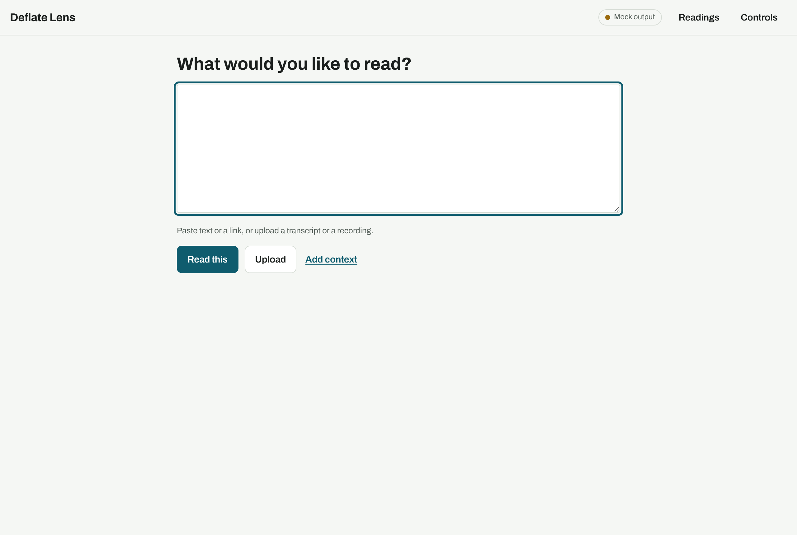
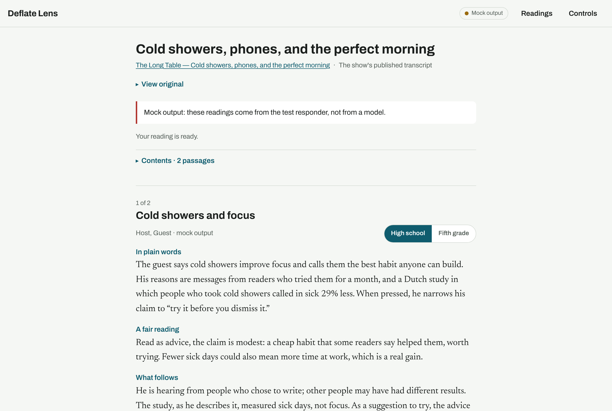
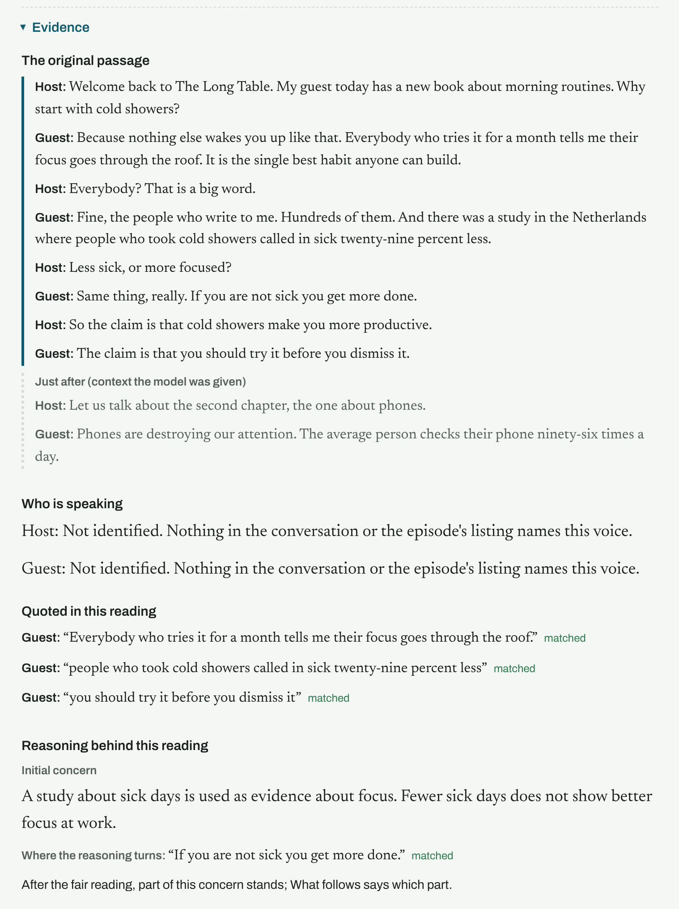
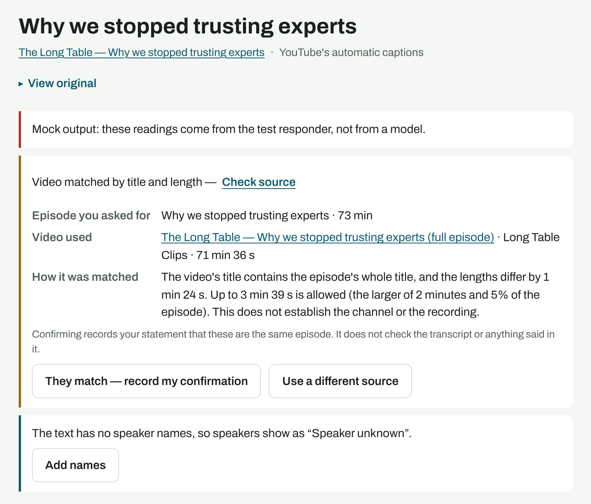
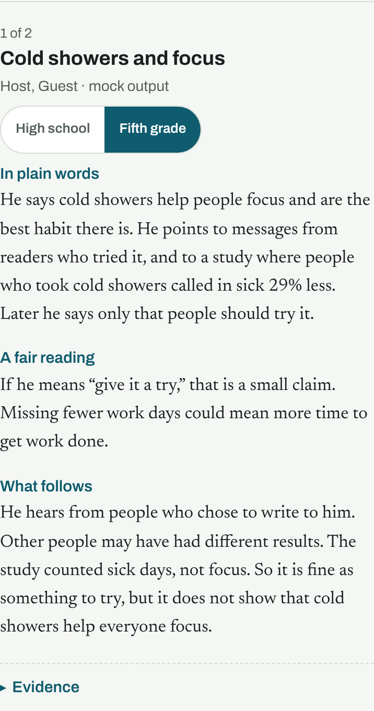

# Deflate Lens

Understand what was said, what supports it, and what remains uncertain. Paste a transcript, a claim, or a podcast, video or page link, or upload a recording. Deflate Lens reads each passage in three short parts: **In plain words** (what was claimed and the reasons given), **A fair reading** (the strongest reasonable interpretation), and **What follows** (the assessment after that). Choose **High school** or **Fifth grade** on any card.

It runs on your own computer. Your work stays there. Only the text being read is sent to the AI model you set up.



## What it looks like

**A reading.** The cards come in passage order. Nothing else is on the card face.



**Evidence, one click away.** The original passage with who said each turn, the turns around it that the model saw, who each speaker is and how the app found out (or why it couldn't, as in this made-up show, where no one says a name), the quotes it used and whether each was found word for word, and the reasoning: the first concern, where the reasoning turns, and whether the concern was kept, partly kept or withdrawn.



**When the source needs a check, it says so.** A video found by searching for the episode's title and length stays marked until you compare the two and confirm.





*These pictures use a made-up show and a stand-in for the AI (the page labels it mock output), so they could be taken without an API key. `npm run screenshots` makes them again.*

## Start it

You need [Node.js](https://nodejs.org) (the LTS download).

**On a Mac:** download and unzip the code, then double-click `Start-Deflate.command`. Keep the Terminal window open while you use it.

**Or in a terminal:**

```sh
git clone https://github.com/Swixixle/deflate-lens.git
cd deflate-lens
npm run setup
npm run launch
```

The app opens at <http://127.0.0.1:3123>. Stop it with `Ctrl+C`. Start it again with `npm run launch`.

**To update:** stop the app, then in the Deflate Lens folder run `npm run update`. (Older copies without that command: `curl -fsSL https://raw.githubusercontent.com/Swixixle/deflate-lens/main/scripts/update.sh | bash`.) Your settings and saved work are kept.

## Use it

1. **Paste or upload.** A transcript file (`.txt`, `.srt`, `.vtt`, `.md`), a recording (MP3, M4A, MP4, WAV and other audio or video files), any text, a single claim, or a podcast, video or page link.
2. **Press Read this.** That is the only button you need. It works out who said what and who each speaker is (keeping any speaker names that came with the text, finding the rest from introductions, people naming themselves and the episode's listing, and setting played clips and advertisements apart), picks the passages, writes and reviews each reading, and looks for sources. You never have to name anyone. You can close the page; it keeps going.
3. **The key, once.** The first time, it asks for your Anthropic API key and saves it on your computer. Readings are billed to that key.
4. **Read.** Open **Evidence** under a card for the original and the reasoning. **Readings** has your saved work; **Controls** has everything optional, and the **User guide**.

The [User guide](docs/guide.md) is short: starting a reading, reading the result, the limits, the optional controls, where your work goes, and what to do when something is stuck.

## What it will and won't tell you

- **Quotes are checked word for word** against the saved text, every time you open a reading. A match that only works with numbers written differently ("fifteen percent" and "15%") says so.
- **An assessment is not a verification.** A "Checkable claim" is something evidence could settle; the app does not decide from the model's memory whether it is true. Searches find possible sources; only you attach one, and only you say whether it supports or contradicts the claim. Nothing is ever marked "verified".
- **The review is a second pass of the same model**, not an independent check. The original is always one click away so you can judge.
- **The speaker is never graded.** Only the argument and each claim.
- **It can be wrong.** When a reading still fails its checks after the app corrects the parts found wrong, the card says it couldn't be completed and its Evidence says why.
- **Who is speaking is worked out, not proven.** By voice from the recording (Deepgram, your key: by itself when a podcast link's transcript has no speaker names), or from the words where they show a change of speaker. Names come from what was said and the episode's listing; a speaker nothing identifies keeps a number, and Evidence says why.

## Settings

Settings live in `.env` in the app folder (setup creates it). The ones you might change:

| Setting | What it does |
|---|---|
| `ANTHROPIC_API_KEY` | Your key for the readings. The page can save it for you. Billed to your Anthropic account. |
| `ANTHROPIC_MAX_TOKENS` | The longest answer a reading may have (default 16000). |
| `RESEARCH_CONTACT_EMAIL` | Your email, so Crossref answers faster. Optional. |
| `DEEPGRAM_API_KEY` | For fast audio-to-text (a podcast's audio or a recording you upload, with the voices told apart), and for separating voices from a recording (done by itself when a link's transcript has no speaker names). Optional; the page asks when needed. Billed to your Deepgram account. |
| `TRANSCRIBE_PREFER` | `local` or `cloud`, when both audio options are set up. `local` keeps audio on this computer: nothing is sent to Deepgram, to transcribe or to separate voices, unless you choose Deepgram when the page asks. |
| `DEFLATE_MOCK_AI` | `1` to try the app with placeholder readings and no key. |

`brew install yt-dlp` makes YouTube captions more reliable. Your work is saved as plain files in the `data/` folder; copy that folder to back it up.

## More

- [docs/guide.md](docs/guide.md): the User guide (also inside the app).
- [docs/technical.md](docs/technical.md): how readings are made and checked, every record the app keeps, how to evaluate readings and run a reader pilot, what was tested and what wasn't.
- [AGENTS.md](AGENTS.md): instructions for an AI assistant installing this on your computer.
- `npm test` runs the regression tests with no key and no network. `npm run ui-check` runs the browser check (needs Playwright). `npm run eval` reads the evaluation cases with your key and writes a scoring sheet.

## License

MIT. See [LICENSE](LICENSE).
