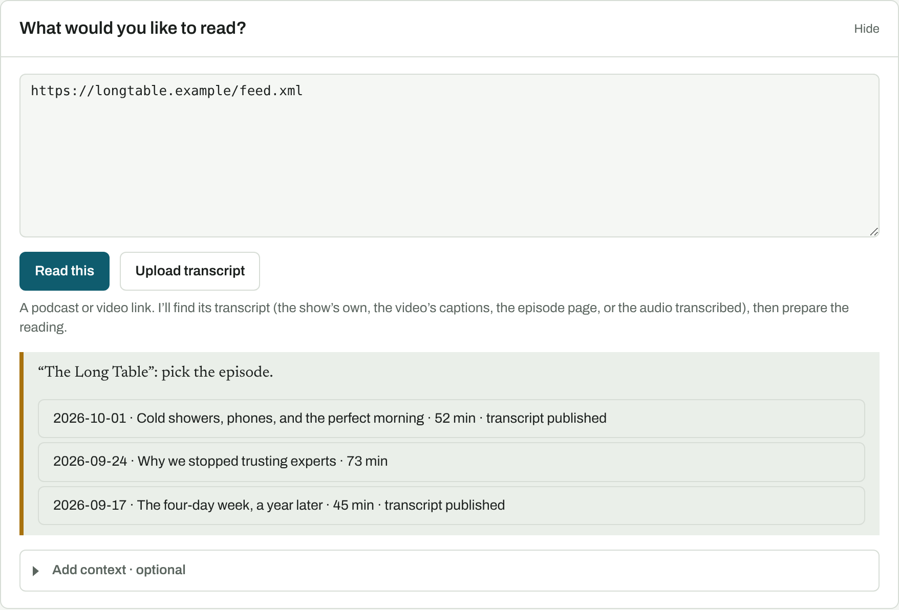
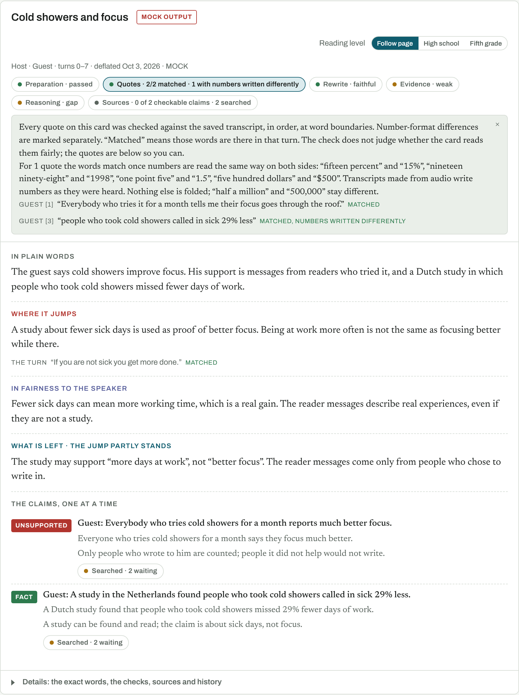
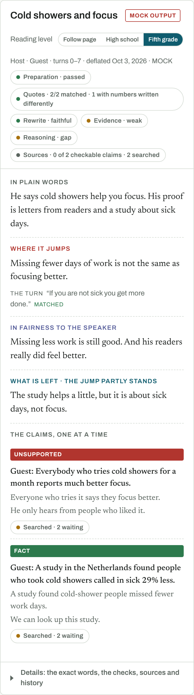

# Deflate Lens

Paste what someone said, a claim, a transcript, or a podcast or YouTube link, and Deflate Lens tells you in plain words what they argued, where the argument jumps, the fairest defense of it, and what is left. Every claim is graded on its own. You pick the reading level: **High school** or **Fifth grade**.

It runs on your own computer. Your work stays there. Only the text being read is sent to the AI model you set up.


## What it looks like

**Paste a podcast link.** It finds the show's episodes. Pick one, and it gets the transcript by itself.



**Read the cards.** Each card says what was said in plain words, where it jumps, the best defense, and what is left. The small chips at the top show what was checked. Click one to see why.



**Switch the level on any card.** Here is the same card at the fifth-grade level, on a phone.



*These pictures use a made-up show and a stand-in for the AI (the page labels it MOCK OUTPUT), so they could be taken without an API key. `npm run screenshots` makes them again.*

## Start it

You need [Node.js](https://nodejs.org) (the LTS download).

**On a Mac:** download and unzip the code, then double-click `Start-Deflate.command`. Keep the Terminal window open while you use it.

**Or in a terminal:**

```sh
git clone https://github.com/Swixixle/deflate-lens.git
cd deflate-lens
npm run setup
npm run launch
```

The app opens at <http://127.0.0.1:3123>. Stop it with `Ctrl+C`. Start it again with `npm run launch`.

**To update:** stop the app, then in the Deflate Lens folder run `npm run update`. (Older copies without that command: `curl -fsSL https://raw.githubusercontent.com/Swixixle/deflate-lens/main/scripts/update.sh | bash`.) Your settings and saved work are kept.

## Use it

1. **Paste or upload.** A transcript file (`.txt`, `.srt`, `.vtt`, `.md`), any text, a web page link, or a podcast or video link.
2. **Press Read this.** That is the only button you need. It checks who said what, picks the passages, writes the readings, checks them again, and searches for sources. You can close the page; it keeps going.
3. **The key, once.** The first time, it asks for your Anthropic API key and saves it on your computer. Searching for sources works without a key.
4. **Read.** Cards only appear after they pass their checks. Use **High school / Fifth grade** at the top of the page or on any card.

Everything else (speaker names, sources, history, downloads) is tucked under **Add context** and **Details**. You never have to open them.

**Podcasts and videos.** Paste an Apple Podcasts, Spotify, YouTube, RSS feed, or episode-page link. It looks for a transcript the show already published, then the episode's YouTube captions (a linked video, or one found by its exact title and length), then the episode page. If none exists, it can turn the audio into text, either on your computer (free and private, but slow, and no speaker names) or with Deepgram (fast, paid, needs a key). It asks you once which one you want. If a transcript has no speaker names, you can type the names under **Add context** and the AI will label the turns; the card then says the names came from the AI.

## What it will and won't tell you

- **Quotes are checked word for word** against the transcript, every time you open a reading. A quote that only matches when numbers are written differently ("fifteen percent" and "15%") says so.
- **Nothing is ever marked "verified."** A source is attached only when a person chooses it. The app searches Crossref, PubMed, OpenAlex and GDELT news and shows what came back; you decide what counts.
- **The speaker is never graded.** Only the argument and each claim.
- **It can be wrong.** The AI writes the readings. The checks catch made-up quotes and missing reading levels, not bad judgment. The quotes are always one click away so you can judge for yourself.

## Settings

Settings live in `.env` in the app folder (setup creates it). The ones you might change:

| Setting | What it does |
|---|---|
| `ANTHROPIC_API_KEY` | Your key for the readings. The page can save it for you. Billed to your Anthropic account. |
| `RESEARCH_CONTACT_EMAIL` | Your email, so Crossref answers faster. Optional. |
| `DEEPGRAM_API_KEY` | For fast audio-to-text. Optional; the page asks when needed. |
| `TRANSCRIBE_PREFER` | `local` or `cloud`, when both audio options are set up. |
| `DEFLATE_MOCK_AI` | `1` to try the app with placeholder readings and no key. |

`brew install yt-dlp` makes YouTube captions more reliable, and lets it find a show's video when the episode doesn't link one. That often saves a long audio transcription. Your work is saved as plain files in the `data/` folder; copy that folder to back it up.

## More

- [docs/technical.md](docs/technical.md): how the checks work, every record the app keeps, what was tested and what wasn't, and the project layout.
- [AGENTS.md](AGENTS.md): instructions for an AI assistant installing this on your computer.
- `npm test` runs 153 checks with no key and no network.

## License

MIT. See [LICENSE](LICENSE).
